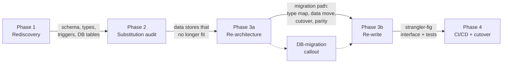

# Database Delivery — Discussion Guide

> Working reference (not part of the MoaW workshop deliverable `docs/workshop.md`).
> Purpose: give you the full surroundings and connections of the **database** story in this
> repo so you can drive a discussion about it. Last synced: 2026-09-09.

---

## 1. TL;DR — what the "database delivery" is

There is **no dedicated database chapter**. Database is delivered as **alignment woven into
Chapter 5 (Modernization)** — reinforcing the existing four-phase loop rather than adding a
standalone section. The one concrete, end-to-end DB migration example (Oracle → Azure
PostgreSQL) lives in an **external** sample repo, not in this repo.

**Design decision:** one delivery, no dedicated section — DB shows up exactly where the
modernization phases already need it (rediscover schema → audit data store → decide
migration path → verify parity).

---

## 2. The delivery just made (edits to `docs/workshop.md`)

| # | Location | Change | Why |
|---|---|---|---|
| 1 | Phase 1 rediscovery — data-model bullet | Added *"data types and encoded value domains"* | Gives downstream type-mapping a documented source |
| 2 | Phase 3a re-architecture — storage bullet | Now *"target store and migration path … (see the database-migration note below)"* | Points readers to the new mechanics note |
| 3 | Phase 3a — **new `info` callout** "Database migrations have their own failure modes" | Adds the missing mechanics: type/constraint mapping, dual-write + backfill, cutover, parity verification | Storage is where modernizations lose data quietly |
| 4 | `### 5.7.4 When to use what? ?` → `### 5.7.5 When to use what?` | Fixed duplicate heading number + stray `? ?` typo | Chapter had two `5.7.4` headings |

All edits are alignment-only; no new section, no Duck tie-in, no new external repos.

---

## 3. The full map — where database lives in this repo

### 3.1 Chapter 5 (Modernization) — the real home

| Tag | Section | What it says about DB |
|---|---|---|
| CORE | 5.2 Phase 1 Rediscovery | Data-model summary (entities, relationships, **types/value domains**, invariants in DB triggers); integration inventory lists **databases** |
| CORE | 5.3 Phase 2 Substitution audit | *"Data stores that no longer fit"* — monolithic RDBMS, dated NoSQL, UI-shaped schema |
| CORE | 5.4.1 Phase 3a Re-architecture | *"Data model and storage choices"* + migration path; **new DB-migration callout** |
| CORE | 5.4.2 Phase 3b Re-write | Behavior-preserving tests + strangler-fig (the guardrails DB parity rides on) |
| CORE | 5.6.2 Track B prompts | `/01-rediscovery-data-model` (DDL, ER diagram), `/01-rediscovery-integrations` (DB tables) |
| CORE | 5.6.1 Track A prompts | spec-kit `specify` blocks mention schema, migration path, data stores |
| HANDSON | 5.7 Modernization agents | SQL auth → Managed Identity task; **Oracle → Azure PostgreSQL** CLI + IDE walkthroughs |

### 3.2 Outside Chapter 5 — incidental only (no DB discussion owed)

- **Chapter 1 / MCP:** "connect to external tools — issue trackers, **databases**, browsers…"
- **Cheat sheet:** Agent Skills example "query a database"; Squad example "API, **database**, tests, docs"
- **User stories (`user-stories/`):** storage requirement only — *"a local JSON file or SQLite is fine"* (browse-catalog, add-to-cart, checkout). No schema, no migration exercise.
- **Prompt files (`.github/prompts/`):** rediscovery/architecture prompts reference DB schema/tables generically.

---

## 4. The surroundings — how DB threads through the modernization loop

**Reading of the flow:** the database is discovered as *facts* in Phase 1, judged as *fit/unfit*
in Phase 2, turned into a *migration decision* in Phase 3a (where the new callout lives),
executed behind a *stable interface with parity tests* in Phase 3b, and *cut over* in Phase 4.

---

## 5. The connections — tools, repos, agents that touch DB

### 5.1 External sample repos (referenced, not in this repo)

| Repo / folder | Pairing | Nature |
|---|---|---|
| `Azure-Samples/java-migration-copilot-samples` → `todo-web-api-use-oracle-db` | Oracle → Azure Database for PostgreSQL | True engine migration (uses `VARCHAR2` etc.) — the only turnkey one |
| …→ `mi-sql-public-demo` | SQL Server password → Managed Identity | **Auth** migration, not engine |
| …→ `asset-manager` | end-to-end → Azure DB for PostgreSQL + Blob + Service Bus | Full workshop scenario |

> Caveat surfaced in discussion: the non-Oracle samples are largely dated / not worth
> anchoring new hands-on paths to. Only Oracle→PostgreSQL is a clean engine pairing.

### 5.2 Tooling paths that can drive a DB migration

- **Modernize CLI** (`modernize plan create "migrate from oracle to azure postgresql"`) — 5.7.3/5.7.4.
- **GitHub Copilot modernization IDE extension** — predefined **migration Tasks** incl. SQL auth → Managed Identity.
- **spec-kit loop** (Track A) — stack-agnostic; the `specify` blocks already name schema + migration path.
- **Copilot-native custom agents** (Track B) — `target-architect`, `module-rewriter`, `substitution-auditor`, `deployment-engineer` (see the agents list) map 1:1 to the phases.
- **MCP** — a database MCP server is the natural way to let the agent introspect a *live* schema during Phase 1 (mentioned as an option, not yet written into the workshop).

### 5.3 Custom agents relevant to DB work (from this repo's agent kit)

| Agent | DB relevance |
|---|---|
| `cobol-archaeologist` | Produces data model + integration inventory (read-only) |
| `substitution-auditor` | Flags unfit data stores |
| `target-architect` | Owns the data-model + migration-path decision |
| `module-rewriter` | Preserves behavior via tests + stable interface (parity) |
| `deployment-engineer` | Strangler-fig cutover mechanism |

---

## 6. What's intentionally NOT there (and why)

- **No dedicated DB chapter / no "choose your own adventure" section** — decided against; DB is
  alignment, not a standalone topic.
- **No per-pairing hands-on** (MySQL→…, Mongo→Cosmos, SQL Server engine swap) — no vetted,
  current sample repos; this repo ships no runnable code by design.
- **No Duck Emporium DB exercise** — modernization deliberately steps away from the greenfield
  duck to use real legacy code.
- **No runnable migration code** — repo is documentation-only.

---

## 7. Gaps still open (talking points for the discussion)

1. **Parity verification depth** — the callout names row counts / checksums / behavior replay,
   but there's no worked example. Worth one?
2. **MCP database server** — add a short `tip` showing live-schema introspection in Phase 1?
3. **Connection-security angle** — SQL auth → Managed Identity is mentioned as a task but not
   tied into the DB narrative. Fold in, or leave as an agent task?
4. **Sample repo freshness** — only Oracle→PostgreSQL is turnkey. Accept single example, or
   invest in a fresher multi-pairing sample later?
5. **Numbering hygiene** — one duplicate heading fixed; worth an editorial pass for others?

---

## 8. Decision log (this discussion)

| Date | Decision |
|---|---|
| 2026-09-09 | DB delivered as **alignment in Chapter 5**, no dedicated section |
| 2026-09-09 | **Do not hunt** for more external sample repos (existing ones dated) |
| 2026-09-09 | Stay on **external/legacy** systems, not the Duck |
| 2026-09-09 | Implemented Phase 1 + Phase 3a enrichments + DB-migration callout; fixed `5.7.4` duplicate |

---

## 9. Quick pointers (current `docs/workshop.md` anchors)

- Phase 1 data-model bullet — data-model summary in 5.2
- Phase 2 unfit data stores — "Data stores that no longer fit" in 5.3
- Phase 3a storage bullet + **DB-migration callout** — 5.4.1
- Phase 3b parity guardrails — 5.4.2
- Oracle → PostgreSQL hands-on — 5.7.4 (CLI) and the IDE walkthrough in 5.7
- When-to-use table — now 5.7.5

> Line numbers shift as the workshop evolves; search by the section titles above rather than
> pinning to a line.
