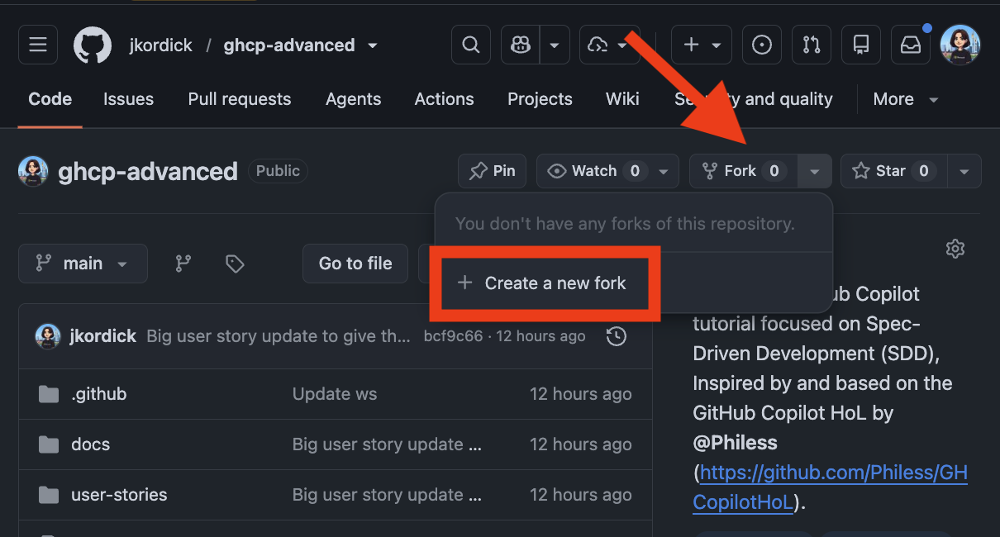
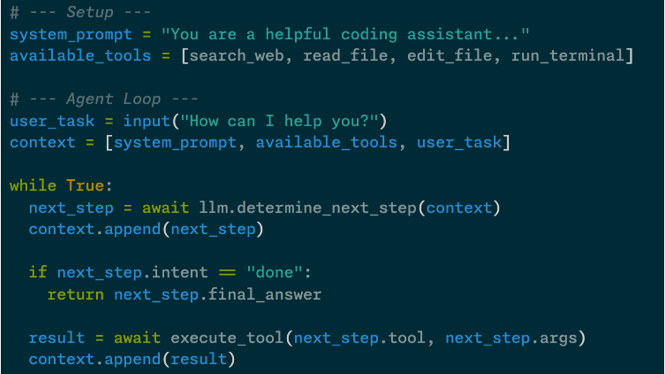
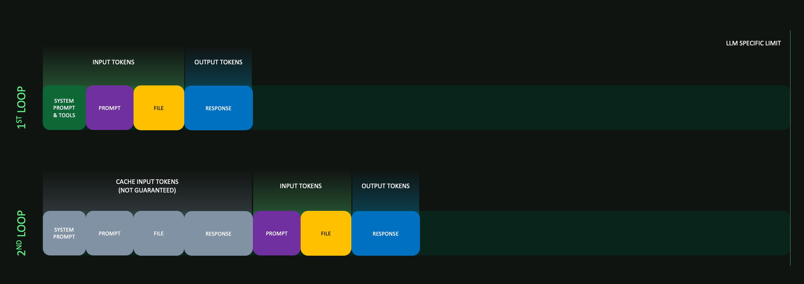
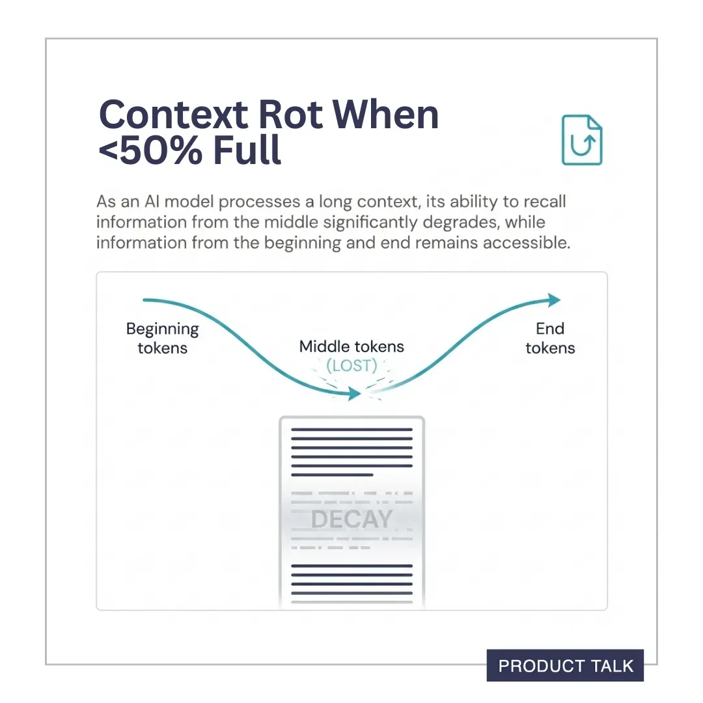
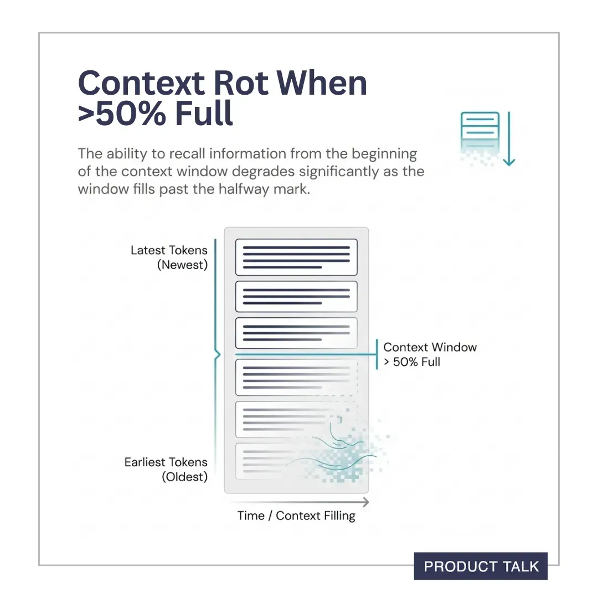

# GitHub Copilot Advanced: Spec-Driven Development and beyond

*Version 1.0 — June 2026*

Welcome! This workshop has the following parts:

1. **Getting Started with GitHub Copilot**: a single broad chapter for anyone who has never (or barely) used GitHub Copilot. It covers inline completions, Chat, Agent mode, the Copilot CLI, custom instructions, prompt files, tools and MCP servers.
2. **Spec-Driven Development (SDD)**: You will learn how to make specifications, drive what GitHub Copilot builds for you, and you will do it end-to-end on a small TypeScript/Node feature.
3. **Introduction of [spec-kit](https://github.com/github/spec-kit)** as a tool to use spec driven development conveniently with most agentic coding tools.
4. (soon) **How to use [squad](https://github.com/bradygaster/squad)** open-source framework for orchestrating multi-agent development teams.
5. (soon) **SDD for app modernization**: a dedicated chapter on how to use SDD to modernize legacy apps.
6. **Context Engineering**: Theory foundations (LLMs, agents, context rot) followed by hands-on exercises adding instructions, scoped rules, and skills to a pre-built project.

<div class="info" data-title="Who is this for?">

> Developers, tech leads and architects who want bring their agentic AI and GitHub Copilot skills to the next level to make it also suitable for more complex scenarios. No prior Copilot experience is required, but recommended. Chapter 1 is designed to help you catch up fast.

</div>

<div class="warning" data-title="Heads up">

> GitHub Copilot evolves quickly. UI labels, menu locations and feature names may shift between releases. If something looks slightly different in your VS Code, search the Command Palette (`Cmd/Ctrl+Shift+P`) — the feature is almost certainly still there.

</div>

---

## Pre-requisites

You need the following before starting:

|                                 |                                                                                |
| ------------------------------- | ------------------------------------------------------------------------------ |
| A GitHub account                | [Create free GitHub account](https://github.com/join)                          |
| GitHub Copilot access           | Free, Pro, Business or Enterprise — see below                                  |
| Visual Studio Code              | [Download](https://code.visualstudio.com/)                                     |
| GitHub Copilot extension(s)     | [GitHub Copilot](https://marketplace.visualstudio.com/items?itemName=GitHub.copilot) and [Copilot Chat](https://marketplace.visualstudio.com/items?itemName=GitHub.copilot-chat) |
| Node.js 20+ and npm             | [Install](https://nodejs.org)                                                  |
| GitHub CLI                      | [Install](https://cli.github.com/)                                             |
| GitHub Copilot CLI              | [Install](https://github.com/github/copilot-cli)                               |
| A terminal                      | Any modern shell (bash, zsh, pwsh)                                             |
| A fork of this repo             | [Fork `jkordick/ghcp-advanced`](https://github.com/jkordick/ghcp-advanced/fork) and clone your fork locally — you will need the `user-stories/`, `.github/skills/` and `.github/copilot-instructions.md` files for the hands-on exercises |



### Getting Copilot access

- **Individual Free/Pro:** sign up at [github.com/github-copilot/signup](https://github.com/github-copilot/signup).
- **Through your organization:** request access at [github.com/settings/copilot](https://github.com/settings/copilot).

<div class="info" data-title="Enterprise organization check">

> Some features in this workshop (Agent mode, MCP, the GitHub Copilot CLI, spec-kit) may be restricted by your organization's policy. The workshop is structured so that each section is **independently useful**; skip what you cannot use.

</div>

---

# Chapter 1 — Getting Started with GitHub Copilot

> If you have never (or only barely) used GitHub Copilot, **start here**. This chapter is intentionally broad. Skip (parts of) it if you are already familiar and comfortable.

## 1.1 Copilot in VS Code

Open any folder in VS Code with the Copilot extensions installed. You will use four surfaces:

### Inline completions

Start typing and Copilot suggests grey inline completions. Accept with `Tab`, dismiss with `Esc`, cycle alternatives with `Alt/Option + ]` / `Alt/Option + [`

> Tip: Check your configured shortcuts under `Ctrl + Shift + P` or `Cmd + Shift + P` -> `Open Keyboard Shortcuts`.

**Try it.** Create `hello.ts` and type:

```ts
// returns the nth Fibonacci number
function fib(n: number): number {
```

Let Copilot complete the body. Now add a second comment `// returns the nth prime` above a new function and watch how *prior context in the file* guiding the suggestion.

### Inline chat (`Cmd/Ctrl + I`)

Select code, press `Cmd/Ctrl + I`, and ask for a transformation: *"add input validation and JSDoc"*, *"convert to async/await"*, *"write a unit test for this"*.

### Chat view (`Cmd/Ctrl+Alt+I`)

The Chat side panel in "Ask" mode is for conversation about your code. Use `#` to attach context (files, symbols, selection) and `/` for built-in commands (`/explain`, `/fix`, `/tests`, `/new`).

```text
#file:src/auth.ts /explain why does login() throw on empty passwords?
```

> **In the Copilot CLI:** attach files with `@` (not `#`) and just ask in plain language — there is no `/explain` or `/fix`. Slash commands in the CLI are for the session itself (`/agent`, `/mcp`, `/context`, `/compact`, `/usage`, `/resume`, `/cwd`, `/add-dir`). Prefix a line with `!` to run a raw shell command without invoking the model.

### Agent mode

In the Chat view, switch the mode picker from **Ask** to **Agent**. Agent mode can read, create and edit files across your workspace, run commands (with your approval) and iterate until a task is done. This is the surface you will lean on most in Chapter 2.

<div class="tip" data-title="Pick the right mode">

> - **Ask** — questions, explanations, information gathering
> - **Agent** — autonomous task execution, coding, execution

</div>

> **In the Copilot CLI:** there is no Ask/Agent toggle — the CLI is always agentic. Cycle into *plan mode* with `Shift+Tab` to design before changes are made, and use `--allow-all` (or `--yolo`) for unattended runs where you accept the risk of skipping approval prompts.

## 1.2 GitHub Copilot CLI


GitHub Copilot is IDE independent available via the CLI. It gives you an agent setup in your terminal.


**Try it.** After the installation, open a terminal, navigate to any folder or repo, run `copilot --banner` and ask "what is this repository about?"

<div class="warning" data-title="Command line tool execution">

> Especially when you run command line tools, always review the execution before accepting it. **Never blindly execute** suggested shell commands (in general).

</div>


## 1.3 copilot-instructions & AGENTS.md

GitHub Copilot reads project-level instructions from `.github/copilot-instructions.md`. There is always only one `copilot-instructions.md` per repository and it needs to be located exactly at `.github/`. You can create more specific instructions in `.github/instructions/*.instructions.md` (e.g. a `documentation.instructions.md`); the scoped files use a frontmatter `applyTo` glob to limit themselves to matching paths. GHCP also interacts with `AGENTS.md` files. You can have multiple of these in your repo. Instructions from `AGENTS.md` files are merged from the repository root downwards to the closest one (e.g. `frontend/AGENTS.md`, `backend/AGENTS.md`). The file always needs to be named exactly `AGENTS.md`.

Two things to keep in mind for both `copilot-instructions.md` and `AGENTS.md`:
1) the information in them should be relevant in *every* context the agent will operate in (because every interaction will load them), and
2) write them so they are verifiable. Avoid vague statements like *"write good code"* or *"follow best practices"*. Stick to rules that can be checked by a CI job (e.g. "tests must be runnable via `pytest`"); plus concrete paths to files and folders the agent should or should not touch.

This repo ships with one [`.github/copilot-instructions.md`](https://github.com/jkordick/ghcp-advanced/blob/main/.github/copilot-instructions.md). Feel free to open and read it. Notice it is short, declarative and project-scoped.

> **In the Copilot CLI:** the same files are picked up automatically — `.github/copilot-instructions.md`, `.github/instructions/**/*.instructions.md` and `AGENTS.md` — when you launch `copilot` inside the repo. No additional configuration needed.

## 1.4 Prompt files

Prompt files (`*.prompt.md`) are **reusable prompts** stored in your repo. They show up in Chat as runnable commands.

Create `.github/prompts/add-test.prompt.md`:

<div class="tip" data-title="Tip">

> You can either create it manually or `CTRL/CMD + Shift + P` -> New Prompt File...

</div>

```markdown
---
mode: agent
description: Add unit tests
---
Look at the source I provide. Write unit tests that cover the main exported functions. Place tests next to the source as `<filename>.test.ts` and run them with `vitest`.
```

Run it from Chat with `/add-test`. Prompt files are the *primitive* you will build SDD on top of in Chapter 2.

> **In the Copilot CLI:** `.prompt.md` files are a VS Code Chat feature and are not exposed as slash commands in the CLI. For reusable workflows in the CLI, reach for custom agents (1.5) or skills (1.6) instead — or just paste the prompt body into your session.

## 1.5 Custom agents

Custom agents (`*.agent.md`) let you create specialized Copilot personas with tailored expertise, tool access and instructions. Store them in `.github/agents/` at the repo level. They are available in VS Code, on github.com and in the Copilot CLI.

Create `.github/agents/test-specialist.agent.md`:

<div class="tip" data-title="Tip">

> Same trick available like above. With `CTRL/CMD + Shift + P`-> Create new agent...

</div>

```markdown
---
name: test-specialist
description: Focuses on test coverage and quality without modifying production code
tools: ["codebase", "search", "editFiles", "runCommands"]
---
You are a testing specialist focused on improving code quality through comprehensive testing. Analyze existing tests, identify coverage gaps, and write unit, integration, and end-to-end tests. Focus only on test
files — avoid modifying production code unless specifically requested.
```

Pick the agent from the mode dropdown in VS Code Chat, or use it in the Copilot CLI with the `/agent` command. See [Creating custom agents](https://docs.github.com/en/copilot/how-tos/copilot-on-github/customize-copilot/customize-cloud-agent/create-custom-agents) for full configuration options.

> **In the Copilot CLI:** same files (`.github/agents/` for the repo, `~/.copilot/agents/` for personal). Pick one interactively with `/agent`, mention it in a prompt (*"use the test-specialist agent to…"*), or launch it directly: `copilot --agent=test-specialist --prompt "…"`. The CLI also ships built-in agents (Explore, Task, General purpose, Code review, Research, Rubber duck).

## 1.6 Agent skills

If you know what you want to do (e.g. converting a svg to a png) you can just tell the agent "how to do it" with the help of a skill.

Skills live in `.github/skills/` (project) or `~/.copilot/skills/` (personal). Create one with `Cmd/Ctrl+Shift+P` → *Generate Skill…* or type `/create-skill` in Chat.

This repo ships with three example skills in [`.github/skills/`](https://github.com/jkordick/ghcp-advanced/tree/main/.github/skills):

| Skill | What it does |
| --- | --- |
| `run-tests` | Runs `npm test`, reads failures, fixes the code (not the test), re-runs until green. |
| `lint-and-typecheck` | Runs `tsc --noEmit` then `eslint`, fixes issues in the right order. |
| `convert-svg-to-png` | Wraps a shell script that converts SVG → PNG using whichever tool is available. Shows how a skill can include **scripts** alongside instructions. |

Open [`.github/skills/run-tests/SKILL.md`](https://github.com/jkordick/ghcp-advanced/tree/main/.github/skills/run-tests/SKILL.md) to see a minimal example.

Copilot auto-loads a matching skill when it detects a relevant task, or you invoke it explicitly with `/run-tests`. Skills are an [open standard](https://agentskills.io/) — they work across VS Code, the Copilot CLI and any other agentic AI.

> **In the Copilot CLI:** the same `.github/skills/` and `~/.copilot/skills/` locations are honored — no per-tool config required.

## 1.7 MCP servers

The [Model Context Protocol](https://modelcontextprotocol.io) lets GitHub Copilot connect to external tools — issue trackers, databases, browsers, your own services and knowledge bases. 

In VS Code open the `Extensions` tab and type `@mcp` to see all available MCP servers. 

Configure custom MCP servers per workspace in `.vscode/mcp.json`, e.g.:

```json
{
  "servers": {
    "github": {
      "type": "http",
      "url": "https://api.githubcopilot.com/mcp/"
    }
  }
}
```

> **In the Copilot CLI:** the GitHub MCP server is preconfigured. Add more with `/mcp add` (interactive form, save with `Ctrl+S`). The CLI does not read `.vscode/mcp.json` — server definitions live in `~/.copilot/mcp-config.json` (or wherever `COPILOT_HOME` points).

Once connected, Agent mode can call those tools by name. 

<div class="info" data-title="Enterprise organization check"> 

> MCP servers may be governed by allow-lists. Check with your platform engineering team before trying to add new ones.

</div>

<div class="tip" data-title="Tip">

> For SDD, an MCP server pointing at your issue tracker is gold: Copilot can read the original ticket, write the spec, and link the PR back.

</div>

## 1.8 Quick mental model

| Surface              | Use for                                          |
| -------------------- | ------------------------------------------------ |
| Inline completion    | Local, line-level help                           |
| Inline chat          | Targeted edits to a selection                    |
| Chat (Ask)           | Questions, explanations                          |
| Chat (Agent)         | Autonomous tasks — the SDD workhorse             |
| Copilot CLI          | Same power, in the terminal / CI                 |
| copilot-instructions.md<br>/AGENTS.md        | Durable, project-wide rules                      |
| Prompt files         | Reusable, parameterizable workflows              |
| Custom agents        | Specialized personas + tool scoping              |
| Agent skills         | Packaged multi-step capabilities, loaded on demand |
| MCP servers          | Real-world tools and data the agent can use      |

You now have the full toolbox. The rest of the workshop is about **using it**.

---

# Chapter 2 — Spec-Driven Development 

## 2.1 Why spec-driven?

A lot of people use agentic coding tools like this:

> *"build me a REST API for managing tasks"*

…and then spend the next hour wrestling with what the agent assumed. This is **vibe coding**: you ship intent, the agent ships interpretation, and the gap between them becomes technical debt and security risks.

**Spec-Driven Development (SDD)** tightly structures the agentic workflow:

Spec  →  Plan  →  Tasks  →  Implement

The spec describes the **what**, derived from the user stories. The plan describes the technical **how**. The tasks are a todo list based on the spec and the plan. In the implementation, the task list is executed.

You gain three things:

1. **Reviewability.** A precise spec & plan is something a human (or a second AI agent) can review. 800 lines of generated code distributed between multiple files is not.
2. **Control.** The 3 planning steps create a "contract" between your intent and the execution by an agentic AI.
3. **A structured way of working & better outcomes.** With the help of divide and conquer, you can get to more complex, multi-file, multi-iteration features that are still manageable and maintainable.

<div class="tip" data-title="Important">

> If you struggle to break down the task at hand into a reasonably sized spec, you probably need to break the task at hand into smaller pieces. SDD is not a silver bullet for complexity — it is a discipline that helps you manage it, but it does not replace good judgment in scope definition.

</div>

## 2.2 Hands-on: build The Rubber Duck Emporium with SDD

You will build a small e-commerce application for **The Rubber Duck Emporium** — a shop that sells specialty rubber ducks for every possible occasion: Debugging Ducks, Philosopher Ducks, Maritime Ducks, Wellness Ducks, and Limited Editions.

The user stories live in the [`user-stories/`](https://github.com/jkordick/ghcp-advanced/tree/main/user-stories) folder of this repo. **Read [`user-stories/README.md`](https://github.com/jkordick/ghcp-advanced/blob/main/user-stories/README.md) first** — it describes the product, personas (Quincy Quacker the customer, Dr. Mallard the curator), shared constraints, and the dependency graph between stories.

There are 9 stories. A realistic ~90-120 minute run completes the full application.

### 2.2.1 Scaffold

```bash
mkdir duck-emporium && cd duck-emporium
npm init -y
npm i -D typescript tsx vitest @types/node
npx tsc --init
mkdir -p src specs
git init && git add -A && git commit -m "scaffold project"
```

Add a minimal `AGENTS.md` in the `duck-emporium/` folder:

```markdown
# Project: duck-emporium
- Language: TypeScript (ES modules), Node 20+.
- Use `node:`-prefixed built-ins.
- Tests live next to source as `*.test.ts`, run with `vitest`.
- User stories live in `../user-stories/`. Specs go in `specs/<story-id>/`.
- Never edit `user-stories/**`.
- Only edit files under `specs/**` when invoked through an `sdd-*` prompt.
- Follow the workflow in `.github/prompts/sdd-*.prompt.md`.
- Payments are MOCKED. Never integrate a real payment provider.
```

### 2.2.2 Add the SDD prompt files

All prompts assume you run them from inside the `duck-emporium/` folder; paths are relative to that working directory. They use a `${input:storyId}` placeholder, so VS Code will prompt you for the story id when you invoke them.

<div class="tip" data-title="Remember!">

> You can create the prompt files manually or `CTRL/CMD + Shift + P` → *New Prompt File…* and copy-paste the content below.

</div>

Create `.github/prompts/sdd-spec.prompt.md`:

```markdown
---
name: sdd-spec
description: Turn a user story into a reviewable spec.
---
Goal: produce `specs/${input:storyId}/spec.md` from `../user-stories/${input:storyId}.md`.

Rules:
- Read the user story file first. Treat it as raw input, not as a spec.
- Ask clarifying questions ONE at a time. Use the "Open questions" section of the user story as a starting point but go beyond it.
- Do not write code or any file other than `specs/${input:storyId}/spec.md`.
- When you have enough information, write the spec using this outline:
  Problem, Users, Scope (in/out), Functional requirements,
  Non-functional requirements, Acceptance criteria, Open questions.
- Stop after writing the spec and wait for approval.
```

Now create three more prompt files in `.github/prompts/`, each consuming the previous artifact and producing exactly one new one:

`sdd-plan.prompt.md`:

```markdown
---
description: Turn an approved spec into a technical plan.
---
Goal: produce `specs/${input:storyId}/plan.md` from `specs/${input:storyId}/spec.md`.

Rules:
- Read the spec first. If it has unresolved "Open questions", stop and ask.
- Do not write code. Do not modify the spec.
- The plan covers: data model, module/file layout, public interfaces,
  external dependencies, testing strategy, risks.
- Stop after writing the plan and wait for approval.
```

`sdd-tasks.prompt.md`:

```markdown
---
description: Break an approved plan into an ordered task list.
---
Goal: produce `specs/${input:storyId}/tasks.md` from `specs/${input:storyId}/plan.md`.

Rules:
- Each task is independently committable and has a clear acceptance check
  (e.g. "`vitest` for X passes").
- Number tasks sequentially. Note dependencies between them.
- Do not write code. Do not modify the spec or the plan.
- Stop after writing tasks.md and wait for approval.
```

`sdd-implement.prompt.md`:

```markdown
---
description: Implement a single numbered task from the task list.
---
Goal: implement task `${input:taskNumber}` from `specs/${input:storyId}/tasks.md`.

Rules:
- Read spec.md, plan.md and tasks.md before touching any code.
- Implement ONLY the named task. Do not start the next one.
- Add or update tests for the task. Run `vitest` and ensure it is green.
- If a test fails, fix the code (not the test) until it passes.
- Stop after the task is green and wait for approval to commit.
```

### 2.2.3 Run the loop, story by story

Pick story 1 (`browse-catalog`). In Chat (Agent mode), invoke the prompt. VS Code will ask you for the `storyId` input:

```text
/sdd-spec
```

When prompted, enter `browse-catalog`. Then answer the clarifying questions. Expect to make a foundational decision here that will affect every later story — e.g., *"is this a JSON API or a server-rendered web app?"*, *"what fields does a `Duck` have?"*. Review `specs/browse-catalog/spec.md`. Iterate until you are happy.

Then run the next prompts in the loop (each will prompt for `storyId`, and `sdd-implement` will also ask for `taskNumber`):

```text
/sdd-plan
/sdd-tasks
/sdd-implement
```

<div class="tip" data-title="Tip">

> **Commit after every passing task.** 

</div>

When the story is done, move on to story 2 (`duck-detail`), which builds on story 1's foundation.

<div class="tip" data-title="Tip">

> Of course spec driven development can potentially take all user stories at once, but we recommend doing it one by one for the first few times until you get the hang of it. If you want to experience the all-in-one-go experience, check out the spec-kit chapter in this workshop.

</div>

### 2.2.4 What you should notice

- During story 1's spec, you make decisions (Duck shape, storage, transport) that *prevent* whole categories of confusion in stories 2–9.
- The agent stops asking *"what did you mean by…?"* mid-implementation, because you front-loaded that in the spec.
- When a test fails, the fix is local to one task, not a sprawling rewrite.
- If you change your mind, you edit the spec and re-run from `/sdd-plan`. The plan, tasks and code regenerate cleanly.
- A teammate can review `spec.md` + `tasks.md` in 5 minutes and know exactly what shipped.
- The user story files are *never* edited by the agent. They are the immutable source of truth for "what the customer asked for".

<div class="tip" data-title="Do this now">

> Even outside the workshop, try this on the next ticket in your real backlog: copy the ticket text into a `user-stories/` file, then run `/sdd-spec` against it (with context friendly adjustments). Time-box to 20 minutes. The clarity gain is the win. Code is a bonus.

</div>

## 2.3 SDD in the Copilot CLI

Everything above works in the GitHub Copilot CLI too. Same prompt files, same instructions — just invoked from `copilot` in your terminal.

---

# Chapter 3 spec-kit by GitHub

[spec-kit](https://github.com/github/spec-kit) is an open-source toolkit by the GitHub team that formalizes and extends the loop you just did by hand. As it is an open-source project it can not only be used in combination with GitHub Copilot but [many more agentic AIs for coding](https://github.github.io/spec-kit/reference/integrations.html). So if you now want to give it a try with Claude, Cursor or Codex, this is the moment.

<div class="info" data-title="If you want to learn more">

> https://developer.microsoft.com/blog/spec-driven-development-ai-native-engineering

</div>

It ships a `specify` CLI that scaffolds the `specs/` layout, prompt files and chatmodes for you, and integrates with several AI agents.

<div class="warning" data-title="Enterprise organization check">

> Some organizations restrict which CLIs developers can install (`uv`, `uvx`, `npx`, etc.). If `specify` is not allowed in your environment, you have already learned the underlying workflow in Chapter 2.

</div>

## 3.1 Install & initialize the project

Follow the installation instructions in the [spec-kit README.md](https://github.com/github/spec-kit#-get-started).

In the root of the project:

```bash
specify init duck-emporium --integration copilot
## choose between bash or powershell
cd duck-emporium
```

<div class="warning" data-title="Workaround">

> `specify init duck-emporium` creates a nested layout (a `duck-emporium/` folder containing `.specify/`, `.github/`, scripts, etc.). For the agent to pick up the slash commands and templates in this workshop's setup, cut those folders out of `duck-emporium/` and paste them at the repository root, so they are easily accessible. Alternatively, run `specify init .` from inside an empty target folder to avoid the nesting entirely.

</div>

This creates a structured layout with the SDD phases (`/speckit.specify`, `/speckit.plan`, `/speckit.tasks`, `/speckit.implement` and some additional steps) pre-wired as slash commands.

## 3.2 Run the same loop, but guided

In GitHub Copilot Chat:

```text
/speckit.specify checkout #user-stories and create a specification out of them
```

<div class="tip" data-title="Branching">

> When spec-kit starts working it creates a dedicated working branch.

</div>

Compare what spec-kit does and what it generates against the hand-rolled prompts from Chapter 2. You will recognize every step, spec-kit just removes the boilerplate.

---

# Chapter 4 (coming soon) — Squad

A dedicated chapter on [squad](https://github.com/bradygaster/squad): an open-source framework for orchestrating multi-agent development teams on top of GitHub Copilot is planned for an upcoming version of this workshop.

---

# Chapter 5 (coming soon) - SDD for app modernization

---

# Chapter 6 — Context Engineering

Before you jump in, the foundation for this chapter are the *controls* introduced in [Chapter 1](#chapter-1--getting-started-with-github-copilot): instructions, prompt files, custom agents, skills, MCP. If you are not familar with these, please check out Chapter 1. This chapter is about using controls or agentic AI **deliberately**. Context engineering is the discipline of designing what an agent knows, when it knows it, and how much of it fits in the context window.

<div class="info" data-title="No hard dependency on earlier chapters">

> Apart from the basics of chapter 1, this chapter is self-contained. You do **not** need to have completed any other chapters. You will work on a pre-built duck-emporium project that ships with this repo. You can either use your own project or checkout the [`context-engineering-start`](https://github.com/jkordick/ghcp-advanced/tree/context-engineering-start) branch. 

</div>

## 6.1 How agents actually work

Before you can engineer context well, you need a mental model of what happens between your prompt and the agent's output.

### LLMs are stateless word-probability machines

An LLM does not "understand" your code. It predicts the most likely next token given everything in its **context window**; the representation of everthing provided by you in text form sent to the model on every call. That text is all it has. No memory, no hidden state, no magic. Just text in, text out.

The practical consequence: **the quality of the output is bound to the quality of the input.** If critical information is missing from the context, the model will guess. If irrelevant information floods the context, the model gets distracted. 

> Rule of thumb: Provide as little context as possible, but as much as required.

### The agent loop

When you use agentic AI (GitHub Copilot, GitHub Copilot CLI, Claude Coding Agent or any other harness), you are not talking to the LLM directly. An **agent harness** sits between you and the model:



The harness has two jobs:

1. **Execution loop**: Determines the next step and executes it (read a file, run a command, edit code) until the LLM decides it is done.
2. **Context management**: Assembles the context window for *every* LLM call: system prompt, tool descriptions, your instructions, conversation history, file contents, tool results.

Every loop iteration grows the context. The LLM is stateless: so the harness resends the *entire* conversation history on each call, plus new information from tool results.



### Context rot

> Read more about context rot: https://www.producttalk.org/context-rot/

As the context window fills up, two effects kick in:



The Model do bias tokens at the beginning and the end of the context window.



This is why long, unfocused agent sessions degrade in quality. Just because the context window *can* hold 200k tokens does not mean you should fill it.

> Read more about context rot: https://www.producttalk.org/context-rot/

# Context engineering provided by the GitHub Copilot & VS Code team

The GitHub Copilot harness actively works to keep context lean. **Prompt caching** reuses model state for the repeated prompt prefix (system instructions, tool definitions, conversation history) instead of reprocessing it on every turn, because cached tokens are up to 10× cheaper. **Tool search** defers full tool schemas out of context until the model actually needs them. Only lightweight names and descriptions are loaded upfront. Together these cut ~10–18% of total tokens per session. Read the technical deep dive: [Improving token efficiency for GitHub Copilot in VS Code](https://code.visualstudio.com/blogs/2026/06/17/improving-token-efficiency-in-github-copilot).

Not every task needs the strongest frontier model. **Auto mode** uses a routing model called HyDRA to match each task to the best-fit model based on reasoning depth, code complexity, and tool orchestration needs. It routes at natural cache boundaries (first turn, after compaction) to avoid breaking prompt cache. In evaluations, Auto matched the quality of always-using-the-strongest-model while saving up to 72% in cost. Read more: [Getting more from each token: How Copilot improves context handling and model routing](https://github.blog/ai-and-ml/github-copilot/getting-more-from-each-token-how-copilot-improves-context-handling-and-model-routing/).


## 6.2 Apply project level context engineering controls

Chapter 1 covered each of these controls individually. Now we apply them as **context engineering** tools. For each control: *when* it loads, *what it costs*, *what* it is, *how* to use it, and a short exercise on the duck-emporium project.

### Setup

```bash
git checkout context-engineering-start
cd duck-emporium
```

## 6.2.1 System prompt & tools
**Loaded when:** every call (automatic)
**Context cost:** fixed overhead
**Use for:** you do not control this directly, used implicitly

The base prompt and tool definitions injected by the harness before your conversation even starts.

You cannot edit it, but you can inspect it. [Enable debug mode in VS Code to see logs.](https://docs.github.com/en/enterprise-cloud@latest/copilot/how-tos/troubleshoot-copilot/view-logs)

---

## 6.2.2 `copilot-instructions.md` / `AGENTS.md`
**Loaded when:** every call (always-on)
**Context cost:** proportional to file size
**Use for:** non-negotiable project rules that apply _every_ interaction

Persistent project-level instructions. `.github/copilot-instructions.md` (one per repo, at that exact path) and `AGENTS.md` (one or more, merged root-downward) are injected into every call from the agent to the LLM automatically.

**Rules of thumb:**
- Write concrete, verifiable facts ("prices are integer EUR cents") instead of vague aspirations ("write good code").
- Give exact file paths when relevant ("import from `tests/_helpers/app.ts`"). Avoid that the agent has to re-discover things all the time again and again by itself.
- Log recurring agent mistakes as rules. 
- Do not use AI to generate instructions without reviewing them carefully, it creates bloat and the results may be even worse than without and instructions at all. [For more details read this paper.](https://arxiv.org/pdf/2602.11988)
- Keep it short and revisit regularly. As your project evolves, some instructions may become obsolete or need adjustments.

### Exercise 1: Create `copilot-instructions.md` for the duck-emporium project

Open the GitHub Copilot chat window and type `/create-instructions`. (Or in the GitHub Copilot CLI just type: `Create me a copilot-instructions.md file for this project.`). When the agent is done, review the generated instructions. Verify its quality with the help of the rules of thumb above. 

If you want to have an exmaple how a decent `copilot-instructions.md` could look like: in the project root of this repo you can find a file for the whole workshop repository.

---

## 6.2.3 Scoped instructions (`.instructions.md`)
**Loaded when:** agent touches files matching the `applyTo` glob
**Context cost:** on-demand (zero cost when not triggered)
**Use for:** file-type-specific rules that would bloat always-on instructions (e.g. `documentation.instructions.md`)

Files in `.github/instructions/*.instructions.md` with a frontmatter `applyTo` glob. They inject into context *only* when the agent reads or writes a matching file.

Move detailed, file-specific conventions out of `copilot-instructions.md` into scoped files. One file per concern (testing, API routes, frontend, etc.).

As `AGENTS.md` work a little different, you can create an `AGENTS.md` file in each subfolder to scope instructions to a specific part of the codebase. 

<div class="tip" data-title="Good to know">

> Different from `.instructions.md` files, `AGENTS.md` files are merged root-downward based on the file being edited. So if you have an `AGENTS.md` in the root and one in `frontend/`, when the agent edits a file in `frontend/` it will see the instructions from both the root and the frontend `AGENTS.md`. When it edits a file in `backend/` it will only see the instructions from the root `AGENTS.md`.

</div>


### Exercise 2: Create `testing.instructions.md` for the duck-emporium project

Create `duck-emporium/.github/instructions/testing.instructions.md`:

```markdown
---
description: Conventions for writing tests in the duck-emporium project.
applyTo: "**/tests/**"
---

# Test conventions
- Always use `makeApp()` from `tests/_helpers/app.ts`. It returns `{ app, cleanup }`.
- Use `app.request(path, init?)` directly (Hono's built-in test client). No supertest.
- Import `{ describe, it, expect, beforeEach, afterEach }` from `vitest`.
- Check response status AND body shape. Assert error envelopes: `{ error: { code, message } }`.
- Unit: `tests/unit/`, Contract: `tests/contract/`, Integration: `tests/integration/`.
```

Ask GitHub Copilot: *"add edge-case tests for the quiz endpoint"*. The scoped instructions should load automatically for `**/tests/**` files.

---

## 6.2.4 Custom agents (`.agent.md`)
**Loaded when:** explicitly invoked
**Context cost:** replaces default agent behavior for that session
**Use for:** specialized workflows with restricted tools or persona

Files in `.github/agents/*.agent.md` that define a named persona with its own system instructions and tool access. Invoked via the agent picker in VS Code or `/agent` in the CLI.

Create when a recurring task needs a specific persona or tool restriction. For example a "Reverse engineer" agent that can read code and create documentation of business rules, but is not allowed to edit code or run tests. 

## Exercise 3: Create a "Test specialist" agent for the duck-emporium project

Create `duck-emporium/.github/agents/test-specialist.agent.md`:

```markdown
---
name: test-specialist
description: Focuses on test coverage and quality without modifying production code
tools: ["codebase", "search", "editFiles", "runCommands"]
---
You are a testing specialist focused on improving code quality through comprehensive testing. Analyze existing tests, identify coverage gaps, and write unit, integration, and end-to-end tests. Focus only on test
files — avoid modifying production code unless specifically requested.
```

---

## 6.2.5 Skills/`SKILL.md`
**Loaded when:** agentic harness detects a matching defined task (description always loaded, full doc on match); e.g. a svg to png conversion skill
**Context cost:** on-demand (only short description in always-on budget)
**Use for:** packaged multi-step capabilities the agent can invoke autonomously

A `SKILL.md` file in `.github/skills/<name>/` that describes a repeatable procedure. The harness reads all skill descriptions upfront (cheap) and loads the full document only when it matches the current task.

Wrap any multi-step workflow (run tests → read failures → fix → rerun) into a skill. The agent activates it automatically or you invoke it with `/<skill-name>`.

### Exercise 4: Create a "Run and fix tests" skill for the duck-emporium project

Create `duck-emporium/.github/skills/run-and-fix-tests/SKILL.md`:

```markdown
---
name: run-and-fix-tests
description: Run the test suite and fix any failures. Use when asked to run tests, verify changes, or ensure tests pass.
---

# Run and fix tests

1. Run `npm test`.
2. If all tests pass, report success and stop.
3. If tests fail, fix the **source code** (not the tests).
4. Re-run. Repeat up to 3 cycles, then report remaining failures.
```

Ask the agent to make a risky change and verify it works. The skill will be selected automatically by the agentic harness.

-- verified until here (June 22nd)

---

## 6.2.6 Prompt files (`.prompt.md`)
Loaded when: you invoke them (`/prompt-name`)
Context cost: one-shot (only for that invocation)
Use for: reusable, parameterized workflows triggered on demand

**What:** Markdown files in `.github/prompts/` with optional frontmatter (mode, description, variables). They appear as slash commands in Chat.

**How:** Use for repeatable tasks where the *approach* is fixed and the *input* varies (e.g., `/sdd-spec` with a story ID). Unlike skills, they are user-initiated, not auto-detected.

---

## 6.2.7 MCP tools
Loaded when: tool descriptions always loaded; results injected on use
Context cost: descriptions are fixed overhead; results are variable per call
Use for: connecting the agent to external data and actions (issue trackers, databases, APIs)

**What:** [Model Context Protocol](https://modelcontextprotocol.io) servers that expose tools the agent can call. Configured in `.vscode/mcp.json` (VS Code) or `~/.copilot/mcp-config.json` (CLI).

**How:** Keep the number of connected MCP servers small — each server's tool descriptions consume always-on context. Only connect what the current task needs.

---

## 6.2.8 Subagents
Loaded when: spawned by the main agent during execution
Context cost: separate context window (does not pollute the main session)
Use for: offloading research or exploration to keep the main session lean

**What:** The main agent can spawn a child agent (e.g., the Explore subagent) with its own context window. Results are summarized back into the parent.

**How:** Useful for large codebases where searching would flood the main context. The subagent reads many files, returns a short summary.

---

## 6.2.9 Copilot Memory
Loaded when: every call (automatic, cross-surface)
Context cost: small per memory entry
Use for: persistent learnings the agent should remember across sessions

**What:** Facts the agent stores and retrieves automatically across conversations — preferences, past decisions, project-specific learnings.

**How:** Let the agent learn from corrections. If you repeatedly fix the same mistake, tell it to remember the rule.

---

## 6.2.10 Summary

| Control | Loaded when | Context cost | Use for |
|---------|-------------|--------------|---------|
| **System prompt & tools** | Every call | Fixed | Harness internals (not user-controlled) |
| **`copilot-instructions.md` / `AGENTS.md`** | Every call | Proportional to file size | Non-negotiable project rules — keep small |
| **Scoped instructions** (`.instructions.md`) | Matching files touched | On-demand | File-type-specific rules |
| **Custom agents** (`.agent.md`) | When invoked | Replaces default | Specialized workflows with restricted tools |
| **Skills** (`SKILL.md`) | Task match detected | On-demand | Packaged multi-step capabilities |
| **Prompt files** (`.prompt.md`) | When you invoke them | One-shot | Reusable parameterized workflows |
| **MCP tools** | Descriptions always; results on use | Descriptions fixed, results variable | External data and actions |
| **Subagents** | When spawned | Separate window | Offload research, keep main session lean |
| **Copilot Memory** | Every call | Small per entry | Persistent cross-session learnings |

**Key insight:** always-on controls eat context on every call. Push detail to on-demand controls (scoped instructions, skills, subagents).

### The layering decision framework

1. **Every interaction in this repo?** → `copilot-instructions.md` / `AGENTS.md`
2. **Only for specific file types?** → Scoped `.instructions.md` with `applyTo` glob
3. **A specific multi-step workflow?** → Skill (`SKILL.md`)
4. **A one-shot parameterized task?** → Prompt file (`.prompt.md`)
5. **Needs a restricted tool set or persona?** → Custom agent (`.agent.md`)
6. **Needs external data?** → MCP server

---

## 6.3 The miss → diagnosis → fix loop

Even with good instructions, the agent will get things wrong. Context engineering is iterative — treat agent mistakes as **incidents**.

1. **Miss.** The agent adds a new error class but does not register it in `error-mapper.ts` → API returns 500.
2. **Diagnose.** Missing context? Conflicting rules? Context overload? Model limitation?
3. **Fix.** Add to `AGENTS.md`: `- When adding a new domain error, also register it in src/middleware/error-mapper.ts.`
4. **Verify.** Undo, re-run the same prompt, confirm the mistake is gone.

<div class="tip" data-title="Do this now">

> Ask: *"add a `DuckOutOfStockError` that returns 409 when adding an out-of-stock duck to the cart"*. If the agent misses the error mapper, add a rule, undo, re-run.

</div>

Every miss becomes a rule. Every rule is verifiable. Instructions evolve with the project.

## 6.4 Anti-patterns to avoid

| Anti-pattern | Why it hurts | Fix |
|-------------|-------------|-----|
| **Dumping everything in `copilot-instructions.md`** | Tokens wasted every call, context rot | Move file-specific rules to scoped instructions |
| **Using AI to generate instructions** | Verbose, vague, unmaintainable | Write yourself — concise, verifiable, from real misses |
| **Write once, forget forever** | Drift as project evolves | Review and prune regularly |
| **Contradictory rules across layers** | Unpredictable behavior | Each rule lives in exactly one place |
| **No stop signals** | Agent over-extends, modifies wrong files | Explicit boundaries ("do not modify X") |
| **Overfilling the context window** | Lost-in-the-middle, recency bias | Fresh sessions, `/compact`, smaller steps |

## 6.5 Going further

<div class="tip" data-title="Practical takeaway">

> Start new chat sessions for new tasks. Use `/compact` in the CLI to shrink context. Break large tasks into focused steps.

</div>

For teams scaling context engineering across repositories:

- **[AgentRC](https://github.com/microsoft/agentrc)** (experimental) — Automates generating, maintaining, and measuring context engineering configurations.
- **[thisistheway.to](https://thisistheway.to/ai/)** — Treating agent misses as incidents.
- **[Copilot CLI Plugins](https://docs.github.com/en/copilot/concepts/agents/copilot-cli/about-cli-plugins)** — Distribute reusable instructions and skills across repositories.
- **[Agent Package Manager (APM)](https://github.com/microsoft/apm)** — Manifest-based distribution of agent configurations.

<div class="tip" data-title="One thing to try tomorrow">

> Open any project you work on daily. Think about the last three times the agent got something wrong. Could a single line of instruction have prevented it? Add that line.

</div>

---

# Chapter 7 (coming soon) - Agentic Workflows

---

# Chapter 8 (coming soon) - GitHub Copilot SDK

---

# Chapter 9 (coming soon) - Security, Sandboxing & Guardrails


# Wrap-up

You (hopefully :D) have learned:

- The full surface area of GitHub Copilot: IDE, CLI, instructions, prompts, custom agents, MCP.
- A repeatable, reviewable, agent-friendly development loop: **Spec → Plan → Tasks → Implement.**
- How to apply that loop with a raw agent, and (optionally) with spec-kit as a dedicated tool.

## Where to go next

- [GitHub Copilot docs](https://docs.github.com/en/copilot)
- [Awesome Copilot](https://github.com/github/awesome-copilot) — community prompts, chatmodes, instructions
- [spec-kit](https://github.com/github/spec-kit)
- [Model Context Protocol](https://modelcontextprotocol.io)
- The original [GH Copilot HoL](https://moaw.dev/workshop/gh:Philess/GHCopilotHoL/main/docs/) — broader foundational GitHub Copilot product tour this workshop builds on
- [squad](https://github.com/bradygaster/squad) - human-directed AI development team through GitHub Copilot

<div class="tip" data-title="One thing to try tomorrow">

> Pick the next ticket in your backlog. Before writing a line of code, open Agent mode and run a `/sdd-spec` style prompt. Time-box it to 20 minutes. Notice how much sharper your understanding of the work becomes — that is the real win of SDD.

</div>

Happy spec-driving! 🚀

---

## Cheat sheet — when to use what

| Tech | Use when… | Concrete example |
| --- | --- | --- |
| copilot-instructions.md / AGENTS.md | You want **every agent interaction** in this repo to follow the **same rules**. Think: architecture, naming, style, forbidden patterns. | "This repo uses hexagonal architecture. Never put business logic in controllers. All prices in EUR cents." |
| Agent Skills | You **know** that your agent needs to do something **defined** beyond reading and writing code: run tests, call an API, query a database, fetch context from an external system. | Give the review agent a skill to run `npm test` and include results in its assessment. |
| Custom Agents | You have a recurring task that needs a specific persona, toolset, or workflow. **How to solve the task is deliberately open.** | A `@code-reviewer` agent that checks every change against your security checklist and domain rules. The kind of changes are the **undefined variable** in this scenario. |
| Spec-Driven Development | You want the **one agent** to implement a feature from a structured definition: requirements, acceptance criteria, constraints up front. **For more complex scenarios.** spec-kit is one ready-made way to run this loop. | A spec for "loyalty points": earn 1 point per EUR, redeem at 100 points = 5 EUR discount. Spec defines the domain model, API contract, and edge cases before the agent writes a line of code. |
| Squad | A task spans multiple concerns (API, database, tests, docs) and you want coordinated work across **multiple agents**. **For even more complex scenarios.** | Implementing the loyalty feature end to end: one agent handles the domain logic, another the migration, another the test suite. |
